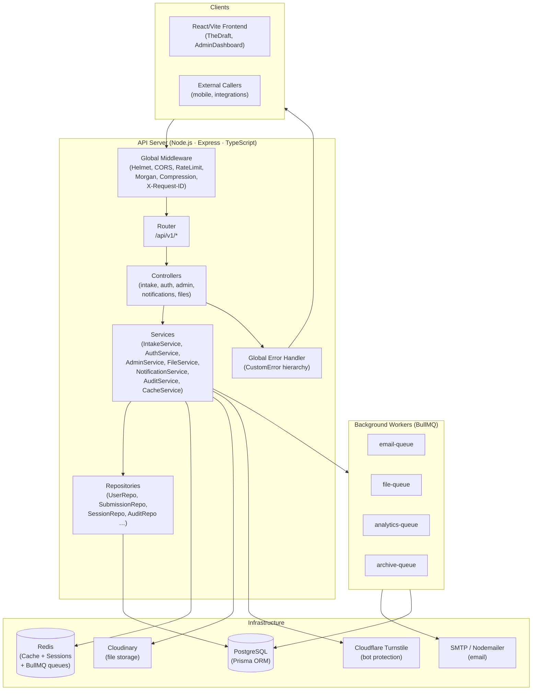

# Design Document: Production Backend Architecture

## Overview

DayZero Foundry's production backend replaces the current Firebase/mock implementation with a self-hosted, fully-typed Node.js/Express/TypeScript API backed by PostgreSQL (via Prisma ORM) and Redis. The design preserves the existing `/api/v1/intake` contract consumed by `TheDraft` frontend component while building a complete platform covering authentication, RBAC, admin APIs, file uploads, notifications, analytics, audit logging, and real-time capabilities.

**Engineering philosophy:** build it once, build it right — every layer is observable, every failure is handled, every contract is typed, and every sensitive operation is auditable.

**Key design decisions:**
- Layered architecture (Routes → Controllers → Services → Repositories) enforces separation of concerns and makes unit testing tractable.
- RS256 JWTs with refresh-token rotation and session-family invalidation (token theft detection) provide the security posture required for production admin access.
- BullMQ over Redis decouples slow operations (email, Cloudinary, archiving) from the request path entirely.
- A single unified response envelope `{ success, message, data, pagination, errors }` is enforced at the global error handler, making frontend integration mechanical.
- Property-based testing with `fast-check` targets the Cast_ID generator and all Zod validators — the areas where combinatorial edge-cases matter most.


## Architecture

### High-Level Component Diagram



### Request Lifecycle

```
Client → [X-Request-ID injection] → [Helmet+CORS] → [Rate limiter]
       → [Morgan log] → [Route match] → [Auth middleware]
       → [Permission middleware] → [Zod validator]
       → [Controller] → [Service] → [Repository/Redis/Cloudinary]
       → [Service response] → [Controller response]
       → [Global error handler if thrown] → Client
```

Every hop propagates the `requestId` through Winston structured logs.


## Components and Interfaces

### Folder Structure

```
files/src/
├── config/           # env validation, constants, Prisma client singleton, Redis client
├── controllers/      # thin HTTP adapters — parse request, call service, send response
│   ├── auth.controller.ts
│   ├── intake.controller.ts
│   ├── admin.controller.ts
│   ├── notification.controller.ts
│   └── file.controller.ts
├── routes/
│   └── v1/           # Express Router definitions, one file per domain
├── middlewares/
│   ├── auth.middleware.ts        # JWT verification, attaches req.user
│   ├── permission.middleware.ts  # RBAC enforcement
│   ├── validate.middleware.ts    # Zod schema runner
│   ├── requestId.middleware.ts   # X-Request-ID generation
│   ├── rateLimiter.middleware.ts # per-route rate limit factories
│   └── upload.middleware.ts      # Multer + magic-byte validation
├── services/         # business logic, orchestrates repos + external clients
│   ├── auth.service.ts
│   ├── token.service.ts
│   ├── intake.service.ts
│   ├── admin.service.ts
│   ├── file.service.ts
│   ├── notification.service.ts
│   ├── audit.service.ts
│   ├── analytics.service.ts
│   └── cache.service.ts
├── repositories/     # Prisma query wrappers — single responsibility per model
│   ├── user.repository.ts
│   ├── submission.repository.ts
│   ├── session.repository.ts
│   ├── audit.repository.ts
│   ├── notification.repository.ts
│   ├── file.repository.ts
│   └── settings.repository.ts
├── models/           # Zod schemas used as both validator and TypeScript type source
├── validators/       # request-specific Zod schemas (composed from models/)
├── jobs/             # BullMQ worker definitions
│   ├── email.worker.ts
│   ├── file.worker.ts
│   ├── analytics.worker.ts
│   └── archive.worker.ts
├── emails/           # HTML/text email templates (Handlebars or inline tagged-template)
├── storage/          # Cloudinary client wrapper + signed URL helpers
├── utils/            # castId generator, pagination helper, crypto utils, response builder
├── types/            # global TypeScript augmentations (Express Request, env)
├── database/         # Prisma client singleton, pagination guard middleware
├── logs/             # runtime log files (gitignored except .gitkeep)
└── tests/
    ├── unit/
    ├── integration/
    └── api/
```

### Service Interface Contracts

```typescript
// IntakeService
interface IIntakeService {
  submit(payload: IntakePayload, ip: string): Promise<{ castId: string }>;
}

// AuthService
interface IAuthService {
  register(dto: RegisterDto): Promise<UserPublic>;
  login(dto: LoginDto, ip: string, ua: string): Promise<TokenPair>;
  logout(sessionId: string): Promise<void>;
  logoutAll(userId: string): Promise<void>;
  refresh(refreshToken: string, ip: string): Promise<TokenPair>;
  forgotPassword(email: string): Promise<void>;
  resetPassword(token: string, newPassword: string): Promise<void>;
  verifyEmail(token: string): Promise<void>;
  resendVerification(userId: string): Promise<void>;
}

// TokenService
interface ITokenService {
  signAccess(payload: AccessPayload): string;
  signRefresh(): { raw: string; hash: string; expiresAt: Date };
  verifyAccess(token: string): AccessPayload;
}

// FileService
interface IFileService {
  upload(file: Express.Multer.File, entity: string, userId: string): Promise<FileRecord>;
  delete(fileId: string, requesterId: string): Promise<void>;
  getSignedUrl(fileId: string): Promise<string>;
}

// CacheService
interface ICacheService {
  get<T>(key: string): Promise<T | null>;
  set<T>(key: string, value: T, ttlSeconds: number): Promise<void>;
  del(key: string): Promise<void>;
  getOrSet<T>(key: string, ttlSeconds: number, factory: () => Promise<T>): Promise<T>;
}
```


## Data Models

### Complete Prisma Schema (all 16 tables)

```prisma
generator client {
  provider = "prisma-client-js"
}

datasource db {
  provider = "postgresql"
  url      = env("DATABASE_URL")
}

// ─── Enums ───────────────────────────────────────────────────────────────────

enum SubmissionStatus {
  pending
  reviewing
  accepted
  rejected
}

enum NotificationChannel {
  email
  in_app
  push
}

enum NotificationStatus {
  pending
  sent
  failed
  read
}

enum FileEntityType {
  submission
  user
  report
}

// ─── Identity & Auth ─────────────────────────────────────────────────────────

model User {
  id              String    @id @default(dbgenerated("gen_random_uuid()")) @db.Uuid
  email           String    @unique
  passwordHash    String
  firstName       String?
  lastName        String?
  emailVerified   Boolean   @default(false)
  verifyToken     String?
  verifyTokenExp  DateTime?
  resetToken      String?   // SHA-256 hash of the raw token
  resetTokenExp   DateTime?
  isActive        Boolean   @default(true)
  createdAt       DateTime  @default(now()) @db.Timestamptz
  updatedAt       DateTime  @updatedAt @db.Timestamptz
  deletedAt       DateTime? @db.Timestamptz

  userRoles       UserRole[]
  sessions        Session[]
  notifications   Notification[]
  files           File[]
  auditActions    AuditLog[]     @relation("AuditActor")
  activityLogs    ActivityLog[]
  submissions     IdeaSubmission[]
  payments        Payment[]
  subscriptions   Subscription[]

  @@index([email])
  @@index([isActive])
  @@index([deletedAt])
  @@map("users")
}

model Role {
  id          String   @id @default(dbgenerated("gen_random_uuid()")) @db.Uuid
  name        String   @unique  // super_admin | admin | moderator | user | guest
  description String?
  createdAt   DateTime @default(now()) @db.Timestamptz
  updatedAt   DateTime @updatedAt @db.Timestamptz
  deletedAt   DateTime? @db.Timestamptz

  rolePermissions RolePermission[]
  userRoles       UserRole[]

  @@map("roles")
}

model Permission {
  id          String   @id @default(dbgenerated("gen_random_uuid()")) @db.Uuid
  name        String   @unique  // e.g. submissions:read
  description String?
  createdAt   DateTime @default(now()) @db.Timestamptz
  updatedAt   DateTime @updatedAt @db.Timestamptz
  deletedAt   DateTime? @db.Timestamptz

  rolePermissions RolePermission[]

  @@map("permissions")
}

model RolePermission {
  id           String     @id @default(dbgenerated("gen_random_uuid()")) @db.Uuid
  roleId       String     @db.Uuid
  permissionId String     @db.Uuid
  createdAt    DateTime   @default(now()) @db.Timestamptz
  updatedAt    DateTime   @updatedAt @db.Timestamptz
  deletedAt    DateTime?  @db.Timestamptz

  role         Role       @relation(fields: [roleId], references: [id])
  permission   Permission @relation(fields: [permissionId], references: [id])

  @@unique([roleId, permissionId])
  @@index([roleId])
  @@index([permissionId])
  @@map("role_permissions")
}

model UserRole {
  id        String    @id @default(dbgenerated("gen_random_uuid()")) @db.Uuid
  userId    String    @db.Uuid
  roleId    String    @db.Uuid
  grantedBy String?   @db.Uuid
  createdAt DateTime  @default(now()) @db.Timestamptz
  updatedAt DateTime  @updatedAt @db.Timestamptz
  deletedAt DateTime? @db.Timestamptz

  user      User      @relation(fields: [userId], references: [id])
  role      Role      @relation(fields: [roleId], references: [id])

  @@unique([userId, roleId])
  @@index([userId])
  @@index([roleId])
  @@map("user_roles")
}

model Session {
  id             String    @id @default(dbgenerated("gen_random_uuid()")) @db.Uuid
  userId         String    @db.Uuid
  refreshHash    String    @unique  // bcrypt hash of the raw refresh token
  familyId       String    @db.Uuid // all rotations share the same familyId
  ipAddress      String?
  userAgent      String?
  expiresAt      DateTime  @db.Timestamptz
  revokedAt      DateTime? @db.Timestamptz
  createdAt      DateTime  @default(now()) @db.Timestamptz
  updatedAt      DateTime  @updatedAt @db.Timestamptz
  deletedAt      DateTime? @db.Timestamptz

  user           User      @relation(fields: [userId], references: [id])

  @@index([userId])
  @@index([familyId])
  @@index([expiresAt])
  @@map("sessions")
}
```


```prisma
// ─── Idea Submissions ────────────────────────────────────────────────────────

model IdeaSubmission {
  id                String           @id @default(dbgenerated("gen_random_uuid()")) @db.Uuid
  castId            String           @unique  // DZ-YY-NNNN
  ideaName          String
  ambitionLevel     Int              // 0-4 maps to AMBITION_LABELS
  description       String           @db.Text
  submitterName     String
  submitterEmail    String
  submitterRole     String?
  affiliation       String?
  category          String?
  ipAddress         String?
  fileUrl           String?
  fileId            String?          @db.Uuid
  turnstileVerified Boolean          @default(false)
  status            SubmissionStatus @default(pending)
  userId            String?          @db.Uuid // null for anonymous submissions
  createdAt         DateTime         @default(now()) @db.Timestamptz
  updatedAt         DateTime         @updatedAt @db.Timestamptz
  deletedAt         DateTime?        @db.Timestamptz

  user              User?            @relation(fields: [userId], references: [id])
  file              File?            @relation(fields: [fileId], references: [id])

  @@index([status])
  @@index([category])
  @@index([submitterEmail])
  @@index([createdAt])
  @@index([deletedAt])
  @@map("idea_submissions")
}

// ─── Notifications ───────────────────────────────────────────────────────────

model Notification {
  id        String              @id @default(dbgenerated("gen_random_uuid()")) @db.Uuid
  userId    String?             @db.Uuid
  channel   NotificationChannel
  status    NotificationStatus  @default(pending)
  subject   String?
  body      String              @db.Text
  metadata  Json?               // FCM token, email recipient, etc.
  readAt    DateTime?           @db.Timestamptz
  sentAt    DateTime?           @db.Timestamptz
  createdAt DateTime            @default(now()) @db.Timestamptz
  updatedAt DateTime            @updatedAt @db.Timestamptz
  deletedAt DateTime?           @db.Timestamptz

  user      User?               @relation(fields: [userId], references: [id])

  @@index([userId])
  @@index([status])
  @@index([channel])
  @@index([createdAt])
  @@map("notifications")
}

// ─── Files ───────────────────────────────────────────────────────────────────

model File {
  id               String         @id @default(dbgenerated("gen_random_uuid()")) @db.Uuid
  uploaderId       String         @db.Uuid
  entityType       FileEntityType
  entityId         String?        @db.Uuid
  cloudinaryId     String         @unique  // public_id
  secureUrl        String
  format           String
  bytes            Int
  width            Int?
  height           Int?
  originalFilename String
  folder           String
  createdAt        DateTime       @default(now()) @db.Timestamptz
  updatedAt        DateTime       @updatedAt @db.Timestamptz
  deletedAt        DateTime?      @db.Timestamptz

  uploader         User           @relation(fields: [uploaderId], references: [id])
  submissions      IdeaSubmission[]

  @@index([uploaderId])
  @@index([entityType, entityId])
  @@index([createdAt])
  @@map("files")
}

// ─── Payments & Subscriptions ────────────────────────────────────────────────

model Payment {
  id            String    @id @default(dbgenerated("gen_random_uuid()")) @db.Uuid
  userId        String    @db.Uuid
  amount        Decimal   @db.Decimal(10, 2)
  currency      String    @default("INR")
  status        String    // pending | completed | failed | refunded
  provider      String    // stripe | razorpay
  providerRefId String?   @unique
  metadata      Json?
  createdAt     DateTime  @default(now()) @db.Timestamptz
  updatedAt     DateTime  @updatedAt @db.Timestamptz
  deletedAt     DateTime? @db.Timestamptz

  user          User      @relation(fields: [userId], references: [id])

  @@index([userId])
  @@index([status])
  @@index([createdAt])
  @@map("payments")
}

model Subscription {
  id         String    @id @default(dbgenerated("gen_random_uuid()")) @db.Uuid
  userId     String    @db.Uuid
  plan       String
  status     String    // active | cancelled | expired | trialing
  startsAt   DateTime  @db.Timestamptz
  endsAt     DateTime? @db.Timestamptz
  createdAt  DateTime  @default(now()) @db.Timestamptz
  updatedAt  DateTime  @updatedAt @db.Timestamptz
  deletedAt  DateTime? @db.Timestamptz

  user       User      @relation(fields: [userId], references: [id])

  @@index([userId])
  @@index([status])
  @@map("subscriptions")
}
```


```prisma
// ─── Reports ─────────────────────────────────────────────────────────────────

model Report {
  id          String    @id @default(dbgenerated("gen_random_uuid()")) @db.Uuid
  title       String
  type        String    // submissions_export | analytics | custom
  format      String    // csv | pdf | json
  fileUrl     String?
  generatedBy String    @db.Uuid
  filters     Json?
  createdAt   DateTime  @default(now()) @db.Timestamptz
  updatedAt   DateTime  @updatedAt @db.Timestamptz
  deletedAt   DateTime? @db.Timestamptz

  @@index([generatedBy])
  @@index([createdAt])
  @@map("reports")
}

// ─── Audit & Activity ────────────────────────────────────────────────────────

model AuditLog {
  id         String   @id @default(dbgenerated("gen_random_uuid()")) @db.Uuid
  actorId    String?  @db.Uuid
  action     String   // e.g. user.created, submission.status_changed
  entityType String
  entityId   String?
  oldValue   Json?
  newValue   Json?
  ipAddress  String?
  userAgent  String?
  requestId  String?
  createdAt  DateTime @default(now()) @db.Timestamptz
  // updatedAt and deletedAt intentionally omitted — immutable records

  actor      User?    @relation("AuditActor", fields: [actorId], references: [id])

  @@index([actorId])
  @@index([action])
  @@index([entityType, entityId])
  @@index([createdAt])
  @@map("audit_logs")
}

model ActivityLog {
  id         String   @id @default(dbgenerated("gen_random_uuid()")) @db.Uuid
  userId     String?  @db.Uuid
  method     String
  path       String
  statusCode Int
  durationMs Int
  ipAddress  String?
  requestId  String?
  createdAt  DateTime @default(now()) @db.Timestamptz

  user       User?    @relation(fields: [userId], references: [id])

  @@index([userId])
  @@index([path])
  @@index([statusCode])
  @@index([createdAt])
  @@map("activity_logs")
}

// ─── Settings & Analytics ────────────────────────────────────────────────────

model Setting {
  id        String    @id @default(dbgenerated("gen_random_uuid()")) @db.Uuid
  key       String    @unique
  value     Json
  createdAt DateTime  @default(now()) @db.Timestamptz
  updatedAt DateTime  @updatedAt @db.Timestamptz
  deletedAt DateTime? @db.Timestamptz

  @@index([key])
  @@map("settings")
}

model AnalyticsEvent {
  id         String   @id @default(dbgenerated("gen_random_uuid()")) @db.Uuid
  event      String
  userId     String?  @db.Uuid
  properties Json?
  sessionId  String?
  ipAddress  String?
  createdAt  DateTime @default(now()) @db.Timestamptz

  @@index([event])
  @@index([userId])
  @@index([createdAt])
  @@map("analytics_events")
}
```

### Entity Relationship Summary

```
users ──< user_roles >── roles ──< role_permissions >── permissions
users ──< sessions
users ──< notifications
users ──< files ──< idea_submissions
users ──< audit_logs (as actor)
users ──< activity_logs
users ──< payments
users ──< subscriptions
idea_submissions >── files (optional attachment)
```


## API Endpoint Design

All routes are prefixed `/api/v1`. All responses follow: `{ success, message, data, pagination, errors }`.

### Health

| Method | Path | Auth | Description |
|--------|------|------|-------------|
| GET | `/health` | None | Uptime, environment, timestamp |
| GET | `/health/ready` | None | DB + Redis connectivity check |
| GET | `/health/live` | None | Process is alive |

### Auth (`/api/v1/auth`)

| Method | Path | Auth | Description |
|--------|------|------|-------------|
| POST | `/auth/register` | None | Register new user, enqueue verification email |
| POST | `/auth/login` | None | Login, issue access + refresh tokens |
| POST | `/auth/logout` | Bearer | Invalidate current session |
| POST | `/auth/logout-all` | Bearer | Invalidate all sessions for user |
| POST | `/auth/refresh` | Cookie | Rotate refresh token, issue new access token |
| POST | `/auth/forgot-password` | None | Send password reset link |
| POST | `/auth/reset-password` | None | Reset password using token |
| POST | `/auth/verify-email` | None | Verify email using token |
| POST | `/auth/resend-verification` | Bearer | Resend verification email |

### Intake (`/api/v1/intake`)

| Method | Path | Auth | Rate Limit | Description |
|--------|------|------|------------|-------------|
| POST | `/intake` | None | 5/IP/hr | Submit idea (`multipart/form-data`), returns `{ castId }` |

### Notifications (`/api/v1/notifications`)

| Method | Path | Auth | Description |
|--------|------|------|-------------|
| GET | `/notifications` | Bearer | Paginated list of current user's notifications |
| PATCH | `/notifications/:id/read` | Bearer | Mark single notification as read |
| PATCH | `/notifications/read-all` | Bearer | Mark all as read |

### Files (`/api/v1/files`)

| Method | Path | Auth | Description |
|--------|------|------|-------------|
| POST | `/files` | Bearer | Upload file (multipart/form-data) |
| GET | `/files/:id/url` | Bearer | Get signed Cloudinary URL |
| DELETE | `/files/:id` | Bearer | Delete file from Cloudinary + DB |

### Admin — Submissions (`/api/v1/admin`)

| Method | Path | Auth | Permission | Description |
|--------|------|------|-----------|-------------|
| GET | `/admin/submissions` | Bearer | `submissions:read` | Paginated list with filters |
| PATCH | `/admin/submissions/:id` | Bearer | `submissions:write` | Update status |
| POST | `/admin/submissions/bulk` | Bearer | `submissions:write` | Bulk accept/reject/delete |
| GET | `/admin/submissions/export` | Bearer | `submissions:read` | CSV or PDF export |

### Admin — Users

| Method | Path | Auth | Permission | Description |
|--------|------|------|-----------|-------------|
| GET | `/admin/users` | Bearer | `users:read` | Paginated users list |
| POST | `/admin/roles/:userId/assign` | Bearer | `roles:write` (super_admin) | Assign role |
| DELETE | `/admin/roles/:userId/revoke` | Bearer | `roles:write` (super_admin) | Revoke role |

### Admin — Analytics

| Method | Path | Auth | Permission | Description |
|--------|------|------|-----------|-------------|
| GET | `/admin/analytics/summary` | Bearer | `analytics:read` | Aggregate summary (60s Redis cache) |
| GET | `/admin/analytics/timeseries` | Bearer | `analytics:read` | Time-series for charts |

### Admin — Logs, Notifications, Files, Settings

| Method | Path | Auth | Permission | Description |
|--------|------|------|-----------|-------------|
| GET | `/admin/logs/audit` | Bearer | `logs:read` | Paginated audit log |
| GET | `/admin/notifications` | Bearer | `notifications:read` | All notifications |
| POST | `/admin/notifications/broadcast` | Bearer | `notifications:write` | Broadcast to all users |
| GET | `/admin/files` | Bearer | `files:read` | Paginated file list |
| GET | `/admin/settings` | Bearer | `settings:read` | Platform settings |
| PATCH | `/admin/settings` | Bearer | `settings:write` | Update settings |

### Docs

| Method | Path | Auth | Description |
|--------|------|------|-------------|
| GET | `/api/docs` | Optional Basic Auth (prod) | Swagger UI |
| GET | `/api/docs/json` | Optional Basic Auth (prod) | `openapi.json` download |


## Authentication Flow Design

### Token Lifecycle

```mermaid
sequenceDiagram
    participant C as Client
    participant API as API Server
    participant DB as PostgreSQL
    participant RD as Redis

    C->>API: POST /auth/login { email, password }
    API->>DB: SELECT user WHERE email = ?
    API->>API: bcrypt.compare(password, hash)
    API->>API: signAccess(RS256, 15min) → accessToken
    API->>API: generate refreshToken (64 random bytes)
    API->>DB: INSERT sessions { refreshHash, familyId, expiresAt }
    API->>C: { accessToken } + Set-Cookie: refresh=...; HttpOnly; Secure; SameSite=Strict

    Note over C,API: Subsequent protected requests
    C->>API: GET /api/v1/admin/... Authorization: Bearer {accessToken}
    API->>RD: GET permissions:{userId} (5-min TTL)
    alt Cache miss
        API->>DB: SELECT permissions for user
        API->>RD: SET permissions:{userId} TTL=300
    end
    API->>API: Check required permission
    API->>C: 200 response

    Note over C,API: Token refresh
    C->>API: POST /auth/refresh (cookie: refresh=...)
    API->>DB: SELECT session WHERE refreshHash = hash(token)
    alt Token already used (familyId previously rotated)
        API->>DB: DELETE sessions WHERE familyId = ?
        API->>C: 401 TOKEN_STOLEN
    else Valid token
        API->>DB: UPDATE session (revoke old, insert new)
        API->>API: signAccess(RS256, 15min) → newAccessToken
        API->>C: { accessToken } + Set-Cookie: refresh=newToken
    end
```

### Session Family Model (Token Theft Detection)

Each login creates a new `familyId`. Every refresh rotation:
1. Marks the current session row as revoked (`revokedAt = now()`).
2. Inserts a new session row with the same `familyId` and new `refreshHash`.

If an already-revoked token is presented, the server detects the family was compromised and **deletes all sessions** in that family, forcing re-authentication.

### Password Reset Flow

1. Client posts email → server generates 64-byte random token.
2. SHA-256 hash stored in `users.resetToken` with 1-hour expiry.
3. Raw token embedded in email link `…/reset-password?token=RAW`.
4. On reset: SHA-256(RAW) compared to stored hash. On match, update password, clear token, revoke all sessions.

### JWT Claims Structure

```typescript
// Access Token Payload (RS256)
interface AccessPayload {
  sub: string;        // userId
  email: string;
  roles: string[];    // ["admin"]
  emailVerified: boolean;
  sessionId: string;
  iat: number;
  exp: number;        // +15 minutes
}
```

Keys: `RS_PRIVATE_KEY` (signing) and `RS_PUBLIC_KEY` (verification) loaded from env. Key rotation is achieved by updating env and restarting — no stored state.


## Service Layer Design

### Cast_ID Generation

```
DZ-YY-NNNN
  DZ  = constant prefix
  YY  = 2-digit year (UTC, e.g. "25" for 2025)
  NNNN = zero-padded 4-digit sequence, scoped per calendar year
```

The sequence is derived by querying `MAX(cast_id)` for the current year and incrementing atomically. To avoid race conditions under concurrent submissions, the INSERT uses a DB-level sequence or a Redis atomic counter (`INCR castid:{YY}`). Redis counter is the primary path; DB fallback on Redis failure recounts from `MAX`.

```typescript
// castId.ts
export async function generateCastId(redis: Redis, prisma: PrismaClient): Promise<string> {
  const yy = new Date().getUTCFullYear().toString().slice(-2);
  const key = `castid:${yy}`;
  let seq: number;
  try {
    seq = await redis.incr(key);
    if (seq === 1) {
      // First of the year — seed from DB to be safe
      const max = await prisma.ideaSubmission.count({ where: { castId: { startsWith: `DZ-${yy}-` } } });
      if (max > 1) { seq = max + 1; await redis.set(key, seq); }
    }
  } catch {
    const max = await prisma.ideaSubmission.count({ where: { castId: { startsWith: `DZ-${yy}-` } } });
    seq = max + 1;
  }
  if (seq > 9999) throw new Error('Cast ID sequence exhausted for year');
  return `DZ-${yy}-${String(seq).padStart(4, '0')}`;
}
```

### RBAC Middleware

```
auth.middleware.ts   → verifies JWT, attaches req.user
permission.middleware.ts(requiredPermission) →
  1. Check Redis cache key `perm:{userId}`
  2. On miss: join user_roles → role_permissions → permissions WHERE deletedAt IS NULL
  3. Cache result for 5 min
  4. If requiredPermission not in set → throw ForbiddenError
```

### Pagination Guard (Prisma Middleware)

A Prisma `$use` middleware intercepts all `findMany` calls without a `take` value and throws an `InternalError`, preventing accidental unbounded queries from reaching production.


## Queue Architecture

### Named Queues (BullMQ over Redis)

| Queue name | Job types | Retry strategy | Concurrency |
|---|---|---|---|
| `email-queue` | `intake.notification`, `submission.status_changed`, `auth.verify_email`, `auth.reset_password`, `broadcast` | 3 attempts, backoff: 60s → 300s → 900s | 5 workers |
| `file-queue` | `cloudinary.upload`, `cloudinary.delete` | 2 attempts, backoff: 10s → 30s | 3 workers |
| `analytics-queue` | `aggregate.daily`, `flush.events` | 1 attempt, no retry (next cron re-runs) | 1 worker |
| `archive-queue` | `audit.archive`, `activity.cleanup` | 2 attempts, backoff: 5 min | 1 worker |

### Job Payload Contracts

```typescript
interface EmailJobPayload {
  template: 'intake_notification' | 'status_changed' | 'verify_email' | 'reset_password' | 'broadcast';
  to: string | string[];
  subject: string;
  context: Record<string, unknown>;
  notificationId?: string; // to update notification.status on success/failure
}

interface FileJobPayload {
  operation: 'upload' | 'delete';
  cloudinaryId?: string;
  localPath?: string;
  folder?: string;
  fileId?: string;
}
```

### Worker Error Handling

On final failure:
- `email-queue`: Update `notifications.status = 'failed'`, write `error.log` entry with full job data, emit Winston `error` with label `"notification.delivery_failed"`.
- `file-queue`: Update `files.deletedAt` (soft-mark as orphaned), write warning log. Manual cleanup job reconciles Cloudinary vs DB monthly.

### BullMQ Board (optional)

`bull-board` middleware mounted at `/api/admin/queues` behind `super_admin` auth for visual queue inspection in non-production.


## Caching Strategy

### What Gets Cached

| Cache key pattern | Content | TTL | Invalidation |
|---|---|---|---|
| `perm:{userId}` | Resolved permission set (string[]) | 300s | On role/permission assignment or revocation |
| `analytics:summary` | Summary object from analytics query | 60s | TTL expiry only (eventual consistency acceptable) |
| `castid:{YY}` | Current year Cast_ID sequence counter | Persistent | Reset at year rollover (background job Jan 1) |
| `session:{familyId}` | Stolen-family tombstone | 7 days | Not invalidated — used to block revoked families |

### Cache-Aside Pattern

```typescript
// CacheService.getOrSet
async getOrSet<T>(key: string, ttl: number, factory: () => Promise<T>): Promise<T> {
  const cached = await this.redis.get(key);
  if (cached) return JSON.parse(cached) as T;
  const value = await factory();
  await this.redis.setex(key, ttl, JSON.stringify(value));
  return value;
}
```

### Redis Fallback

`CacheService` wraps all Redis calls in try/catch. On `RedisError`, it logs `WARN redis.unavailable` and calls the DB factory directly. The API continues serving — no request is blocked or errored due to cache unavailability. The warning is monitored via log-based alerting.


## File Upload Pipeline

```mermaid
flowchart LR
    C[Client multipart request]
    MW[Multer middleware\nmemoryStorage, 10 MB limit]
    MB[Magic-byte validator\nfile-type npm package]
    CLD[Cloudinary upload\ndayzero/{entity}/{YYYY}/{MM}]
    DB[INSERT files table]
    RB[Rollback: cloudinary.destroy\non DB failure]
    RESP[Return FileRecord]

    C --> MW --> MB
    MB -- invalid MIME --> E422[HTTP 422]
    MB -- valid --> CLD
    CLD -- upload failed --> E500[HTTP 500]
    CLD -- success --> DB
    DB -- DB error --> RB --> E500b[HTTP 500]
    DB -- success --> RESP
```

### MIME Type Allowlist (magic-byte validated)

| MIME Type | Magic bytes |
|---|---|
| `image/jpeg` | `FF D8 FF` |
| `image/png` | `89 50 4E 47` |
| `image/webp` | `52 49 46 46 … 57 45 42 50` |
| `application/pdf` | `25 50 44 46` |
| `application/msword` | `D0 CF 11 E0` |
| `application/vnd.openxmlformats-...` | `50 4B 03 04` |

Implementation uses the `file-type` npm package which reads the first ~4 KB of the buffer, not the declared Content-Type header.

### Cloudinary Folder Structure

```
dayzero/
├── submissions/2025/07/   ← intake form attachments
├── users/2025/07/         ← profile uploads
└── reports/2025/07/       ← generated report PDFs
```

Signed URLs (valid 1 hour) are generated on-demand via `cloudinary.url(publicId, { sign_url: true, expires_at: ... })`.


## Error Handling Hierarchy

```typescript
// Base
class AppError extends Error {
  constructor(
    public message: string,
    public statusCode: number,
    public code: string,
    public errors?: { field?: string; message: string }[]
  ) { super(message); }
}

// Subclasses
class ValidationError    extends AppError { constructor(errors) { super('Validation failed', 400, 'VALIDATION_ERROR', errors) } }
class UnauthorisedError  extends AppError { constructor(code?)  { super('Unauthorised', 401, code ?? 'UNAUTHORISED') } }
class ForbiddenError     extends AppError { constructor()       { super('Forbidden', 403, 'INSUFFICIENT_PERMISSIONS') } }
class NotFoundError      extends AppError { constructor(entity) { super(`${entity} not found`, 404, 'NOT_FOUND') } }
class ConflictError      extends AppError { constructor(msg)    { super(msg, 409, 'CONFLICT') } }
class RateLimitError     extends AppError { constructor()       { super('Too many requests', 429, 'RATE_LIMITED') } }
class InternalError      extends AppError { constructor(msg?)   { super(msg ?? 'Internal error', 500, 'INTERNAL_ERROR') } }
```

### Global Error Middleware

```
errorHandler(err, req, res, next):
  if err instanceof AppError → log at 'warn' (4xx) or 'error' (5xx), respond with envelope
  if err instanceof ZodError → map to ValidationError, respond 400
  else → log full stack at 'error', respond 500 with sanitised message (no stack in prod)
  Always include res.set('X-Request-ID', req.requestId)
```

Uncaught exceptions and unhandled rejections are caught via `process.on('uncaughtException')` and `process.on('unhandledRejection')`, logged with Winston, and the process exits after a graceful drain (SIGTERM flow).


## Logging Architecture

### Winston Transport Configuration

```
┌─────────────────────────────────────────────────────────────────┐
│  Winston Logger (singleton)                                     │
│                                                                 │
│  Transports:                                                    │
│  1. Console (dev only, colorized, human-readable)               │
│  2. DailyRotateFile → src/logs/application-%DATE%.log (all)     │
│  3. DailyRotateFile → src/logs/error-%DATE%.log (ERROR+)        │
│  4. DailyRotateFile → src/logs/api-%DATE%.log (HTTP)            │
│  5. DailyRotateFile → src/logs/auth-%DATE%.log (auth events)    │
│  6. DailyRotateFile → src/logs/database-%DATE%.log (slow query) │
│  7. DailyRotateFile → src/logs/audit-%DATE%.log (audit events)  │
└─────────────────────────────────────────────────────────────────┘

Rotation: daily, maxFiles: 30d, compress: true (gzip)
```

### Log Entry Schema (JSON)

```json
{
  "timestamp": "2025-07-10T12:00:00.000Z",
  "level": "info",
  "message": "Idea submission received",
  "requestId": "req_01J2...",
  "service": "dayzero-api",
  "userId": "uuid | null",
  "castId": "DZ-25-0001",
  "durationMs": 142
}
```

### PII Redaction Rules

Winston uses a custom `format` that walks log metadata and replaces any key matching `/email|password|ip|name|phone/i` with `"[REDACTED]"` when `NODE_ENV === 'production'`. The regex runs on structured metadata only, not the message string — reducing false positives.

### Slow Query Logging

A Prisma `$use` middleware records query duration. Any query exceeding `SLOW_QUERY_THRESHOLD_MS` (default 100ms) emits a `database.log` entry at `warn` level including the model, action, and duration.


## Security Layers

### Middleware Stack Order

```
1.  requestId          — generate X-Request-ID per request
2.  helmet             — strict CSP, HSTS, X-Frame-Options, no-sniff
3.  cors               — CORS_ALLOWED_ORIGINS whitelist
4.  compression        — gzip/br for responses > 1 KB
5.  express.json       — body parsing (2 MB limit)
6.  express.urlencoded — form parsing
7.  morgan             — Apache Combined log format → api.log + stdout
8.  globalRateLimit    — 100 req / 15 min / IP
9.  mongoSanitize      — strip NoSQL operators / prototype pollution
10. routes             — auth middleware → permission middleware → Zod validator → controller
11. notFound           — 404 handler
12. errorHandler       — global error formatter
```

### Per-Route Rate Limits

| Route group | Limit | Window |
|---|---|---|
| `POST /api/v1/auth/*` | 10 req | 15 min |
| `POST /api/v1/intake` | 5 req | 60 min |
| All others | 100 req | 15 min |

Rate limit state is stored in Redis (`rate-limit-redis` store) so limits are consistent across horizontal replicas.

### Cryptographic Standards

| Concern | Implementation |
|---|---|
| Password hashing | bcrypt, cost 12 |
| Access token signing | RS256 (2048-bit RSA keypair) |
| Refresh token generation | `crypto.randomBytes(64).toString('hex')` |
| Refresh token storage | bcrypt hash in DB |
| Password reset token | `crypto.randomBytes(64)` raw, SHA-256 hash stored |
| Email verification token | `crypto.randomBytes(32).toString('hex')` |

### Turnstile Verification

`IntakeService.submit()` calls `https://challenges.cloudflare.com/turnstile/v0/siteverify` with `secret` from env and the client-supplied `cf-turnstile-response` token. A failed or absent token throws `ValidationError` before any DB or file operation.


## Docker / Deployment Architecture

### Multi-Stage Dockerfile

```dockerfile
# Stage 1: builder
FROM node:20-alpine AS builder
WORKDIR /app
COPY package*.json ./
RUN npm ci
COPY . .
RUN npm run build      # tsc → dist/
RUN npm prune --production

# Stage 2: production
FROM node:20-alpine AS production
WORKDIR /app
RUN addgroup -S appgroup && adduser -S appuser -G appgroup
COPY --from=builder /app/dist ./dist
COPY --from=builder /app/node_modules ./node_modules
COPY --from=builder /app/package.json .
COPY --from=builder /app/prisma ./prisma
USER appuser
EXPOSE 4000
ENTRYPOINT ["sh", "-c", "npx prisma migrate deploy && node dist/server.js"]
```

Target image size: < 300 MB (alpine base + production node_modules only).

### docker-compose.yml Services

```yaml
services:
  api:
    build: .
    depends_on:
      postgres: { condition: service_healthy }
      redis:    { condition: service_healthy }
    restart: unless-stopped
    env_file: .env
    ports: ["4000:4000"]
    healthcheck:
      test: ["CMD", "wget", "-qO-", "http://localhost:4000/health/live"]
      interval: 30s
      timeout: 10s
      retries: 3

  postgres:
    image: postgres:16-alpine
    restart: unless-stopped
    volumes: [pgdata:/var/lib/postgresql/data]
    healthcheck:
      test: ["CMD-SHELL", "pg_isready -U $$POSTGRES_USER"]
      interval: 10s
      timeout: 5s
      retries: 5

  redis:
    image: redis:7-alpine
    restart: unless-stopped
    volumes: [redisdata:/data]
    command: redis-server --save 60 1 --appendonly yes
    healthcheck:
      test: ["CMD", "redis-cli", "ping"]
      interval: 10s
      timeout: 5s
      retries: 5

volumes:
  pgdata:
  redisdata:
```

### Health Probe Responses

| Endpoint | Checks | Success | Failure |
|---|---|---|---|
| `GET /health` | None (process alive) | `{ success:true, data:{ uptime, env, ts } }` | — |
| `GET /health/live` | Process alive | `{ success:true, message:"alive" }` | — |
| `GET /health/ready` | Prisma `$queryRaw SELECT 1` + Redis `PING` | `{ success:true, data:{ db:"ok", redis:"ok" } }` | HTTP 503 with failing service name |

### Graceful Shutdown

```typescript
async function shutdown(server: http.Server) {
  logger.info('Shutdown signal received');
  server.close(async () => {
    await bullMQWorkers.forEach(w => w.close());
    await prisma.$disconnect();
    await redis.quit();
    logger.info('Graceful shutdown complete');
    process.exit(0);
  });
  // Force exit after 10 s if connections linger
  setTimeout(() => { logger.error('Forced shutdown'); process.exit(1); }, 10_000);
}
process.on('SIGTERM', () => shutdown(server));
process.on('SIGINT',  () => shutdown(server));
```


## Correctness Properties

*A property is a characteristic or behavior that should hold true across all valid executions of a system — essentially, a formal statement about what the system should do. Properties serve as the bridge between human-readable specifications and machine-verifiable correctness guarantees.*

**Property reflection notes:** After reviewing all testable criteria, the following consolidations were made:
- Requirements 3.4, 15.4, and 15.6 all test the Cast_ID format — consolidated into Property 1 (round-trip) and Property 2 (uniqueness).
- Requirements 9.6 and 15.5 both test Zod schema enforcement — consolidated into Property 5 (valid inputs pass) and Property 6 (invalid inputs rejected).
- Requirements 3.2 and 3.3 both test Turnstile rejection — consolidated into Property 3.
- Requirements 4.6 and 4.7 both test refresh token security — kept as two distinct properties (rotation and theft detection) because they have different invariants.
- Requirements 3.7 and 9.3 both test rate limiting — kept separate as they have different limits and routes.
- Requirements 6.13 and 13.1 both test response structure — consolidated into Property 9.

---

### Property 1: Cast_ID Round-Trip Format

*For any* valid idea intake payload submitted to `POST /api/v1/intake` (with mocked Turnstile and mocked SMTP), the `data.castId` field in the response must match the regular expression `^DZ-\d{2}-\d{4}$`.

**Validates: Requirements 3.4, 15.6**

---

### Property 2: Cast_ID Uniqueness

*For any* sequence of N valid intake submissions in the same calendar year (where N ≤ 9999), all returned `castId` values must be unique — no two submissions may share the same Cast_ID.

**Validates: Requirements 3.4, 15.4**

---

### Property 3: Turnstile Rejection Blocks All Side Effects

*For any* intake request payload where `turnstileToken` is absent or does not pass Cloudflare verification, the endpoint must return HTTP 422 with `{ success: false, errors: [{ field: "turnstileToken", ... }] }` and no `idea_submissions` row must be created in the database.

**Validates: Requirements 3.2, 3.3**

---

### Property 4: Password Hash Cost Factor

*For any* non-empty password string registered via `POST /api/v1/auth/register`, the stored `passwordHash` in the `users` table must be a valid bcrypt hash string beginning with `$2b$12$`, confirming cost factor 12 was used.

**Validates: Requirements 4.2**

---

### Property 5: Refresh Token Rotation Invalidates Previous Token

*For any* authenticated session, after successfully calling `POST /api/v1/auth/refresh` once, presenting the original (now-rotated) refresh token cookie in a second `POST /api/v1/auth/refresh` call must return HTTP 401 — the old token is always invalidated by rotation.

**Validates: Requirements 4.6**

---

### Property 6: Token Theft Detection Revokes Entire Session Family

*For any* session family (established by a single login), if a stale (already-rotated) refresh token is presented, all sessions sharing that `familyId` must be marked as revoked in the `sessions` table, and every subsequent refresh attempt for any token in that family must return HTTP 401.

**Validates: Requirements 4.7**

---

### Property 7: Permission Middleware Enforces Least Privilege

*For any* protected endpoint and *for any* JWT whose roles do not include the endpoint's required permission, the response must be HTTP 403 with `{ success: false, errors: [{ code: "INSUFFICIENT_PERMISSIONS" }] }` — regardless of what other valid claims the token carries.

**Validates: Requirements 5.2, 5.3**

---

### Property 8: RBAC Cache Reflects Current Permissions After Role Change

*For any* user whose role or permission assignment changes, the resolved permission set returned by the permission middleware for that user must reflect the updated permissions (not the stale cached set) on the first request made after the cache TTL expires or is explicitly invalidated.

**Validates: Requirements 5.6**

---

### Property 9: Universal API Response Envelope

*For any* request to any API endpoint (regardless of method, path, authentication state, or outcome), the JSON response body must contain all five top-level keys: `success` (boolean), `message` (string), `data` (object or null), `pagination` (object or null), and `errors` (array or null).

**Validates: Requirements 13.1, 6.13**

---

### Property 10: Zod Validator — Valid Inputs Always Pass

*For any* request body generated by fast-check that satisfies the Zod schema for a given endpoint (all required fields present, all types correct, all constraints met), the request must pass validation middleware and receive a non-400 response from the handler.

**Validates: Requirements 9.6, 15.5**

---

### Property 11: Zod Validator — Invalid Inputs Always Produce Field Errors

*For any* request body that violates a Zod schema (missing required field, wrong type, failed constraint), the response must be HTTP 400 with `{ success: false, errors: [...] }` where every element in `errors` contains at least a `message` string, and errors for known field violations also contain a `field` string.

**Validates: Requirements 9.6, 15.5**

---

### Property 12: File Magic-Byte Rejection

*For any* file upload where the declared `Content-Type` header does not match the file's actual magic bytes, the upload must be rejected with HTTP 422 — no Cloudinary upload and no `files` table row may be created as a side effect.

**Validates: Requirements 7.3**

---

### Property 13: Cloudinary Rollback on DB Failure

*For any* file upload where the Cloudinary upload succeeds but the subsequent `files` table INSERT is made to fail (via mock), the `cloudinary.destroy(publicId)` method must be called exactly once with the `publicId` returned by the upload, and the endpoint must return an error response.

**Validates: Requirements 7.4**

---

### Property 14: X-Request-ID in Every Response

*For any* request to any endpoint (including 404 and 500 responses), the HTTP response headers must include `X-Request-ID` with a non-empty string value.

**Validates: Requirements 9.9**

---

### Property 15: Duplicate Status PATCH Returns 400

*For any* idea submission in state S, sending `PATCH /api/admin/submissions/:id` with `{ status: S }` (the same value it already holds) must return HTTP 400 with `{ success: false, message: "Status is already set to the requested value" }`.

**Validates: Requirements 6.3**


## Error Handling

See [Error Handling Hierarchy](#error-handling-hierarchy) above. Additional conventions:

- All thrown errors bubble to the global `errorHandler` Express middleware. Controllers never call `res.status().json()` directly in error paths — they throw.
- Service methods throw typed `AppError` subclasses; repositories throw raw Prisma errors which are caught and re-thrown as `InternalError` or `ConflictError` (P2002 → ConflictError, P2025 → NotFoundError).
- The global handler strips stack traces from production responses but always logs the full stack to `error.log`.

### Prisma Error Mapping

```
PrismaClientKnownRequestError P2002 (unique constraint) → ConflictError
PrismaClientKnownRequestError P2025 (record not found)  → NotFoundError
PrismaClientValidationError                             → ValidationError
PrismaClientRustPanicError                              → InternalError (+ restart recommended)
```


## Testing Strategy

### Test Pyramid

```
        ▲
       /▲\    API / E2E tests (Supertest)
      / ▲ \   — All route handlers, full middleware stack
     /  ▲  \  — Uses test DB (TEST_DATABASE_URL) + ioredis-mock
    /   ▲   \
   /  Integ  \ Integration tests
  /   Tests   \ — Repository functions against a real test DB
 /─────────────\ — Migration applied fresh per test run
/  Unit Tests   \ — Service functions with mocked repos
/────────────────\ — Pure utility functions (castId, validators)
```

### Property-Based Testing Configuration (fast-check)

Library: `fast-check` (TypeScript-native, no codegen needed)

Each property test is tagged with a comment in the format:
```
// Feature: production-backend-architecture, Property N: <property text>
```

Minimum **100 iterations** per property test (`fc.assert(fc.property(...), { numRuns: 100 })`).

#### Property Test Implementations

**Property 1 & 2 — Cast_ID (unit, `src/tests/unit/castId.test.ts`)**

```typescript
// Feature: production-backend-architecture, Property 1: Cast_ID round-trip format
fc.assert(fc.asyncProperty(validIntakeArb, async (payload) => {
  const castId = await generateCastId(mockRedis, mockPrisma);
  expect(castId).toMatch(/^DZ-\d{2}-\d{4}$/);
}), { numRuns: 200 });

// Feature: production-backend-architecture, Property 2: Cast_ID uniqueness
fc.assert(fc.asyncProperty(fc.integer({ min: 1, max: 100 }), async (n) => {
  const ids = await Promise.all(Array.from({ length: n }, () => generateCastId(mockRedis, mockPrisma)));
  expect(new Set(ids).size).toBe(n);
}), { numRuns: 100 });
```

**Property 9 — Universal response envelope (API tests)**

```typescript
// Feature: production-backend-architecture, Property 9: universal API response envelope
const routeSampler = fc.constantFrom(...allRoutes);
fc.assert(fc.asyncProperty(routeSampler, randomRequestArb, async (route, req) => {
  const res = await supertest(app)[route.method](route.path).send(req.body);
  expect(res.body).toMatchObject({
    success: expect.any(Boolean),
    message: expect.any(String),
  });
  expect('data' in res.body).toBe(true);
  expect('errors' in res.body).toBe(true);
}), { numRuns: 100 });
```

**Properties 10 & 11 — Zod validators**

```typescript
// Feature: production-backend-architecture, Property 10: valid inputs pass Zod
fc.assert(fc.property(validIntakeArb, (payload) => {
  const result = intakeSchema.safeParse(payload);
  expect(result.success).toBe(true);
}), { numRuns: 200 });

// Feature: production-backend-architecture, Property 11: invalid inputs produce field errors
fc.assert(fc.property(invalidIntakeArb, (payload) => {
  const result = intakeSchema.safeParse(payload);
  expect(result.success).toBe(false);
  if (!result.success) {
    result.error.errors.forEach(e => {
      expect(typeof e.message).toBe('string');
    });
  }
}), { numRuns: 200 });
```

### Coverage Target

Minimum 80% line coverage across:
- `src/services/**`
- `src/controllers/**`
- `src/validators/**`

Tooling: Vitest (unit + integration) with `@vitest/coverage-v8`, Supertest for API tests.

### Test Database

Tests use `TEST_DATABASE_URL` pointing to a dedicated `dayzero_test` database. A `beforeAll` hook runs `prisma migrate deploy` against it. `ioredis-mock` is used for Redis in unit and API tests; a real Redis is used in integration tests if `TEST_REDIS_URL` is provided.

### Mock Strategy

| Layer | Mock approach |
|---|---|
| Cloudinary | `jest.mock` / `vi.mock` wrapping `v2.upload` and `v2.destroy` |
| Nodemailer | In-memory transport (`nodemailer.createTransport({ jsonTransport: true })`) |
| Turnstile | HTTP interceptor returning `{ success: true }` for tests |
| Redis | `ioredis-mock` in unit/API tests, real Redis in integration |
| BullMQ | `bullmq` worker replaced with synchronous handler in tests |

